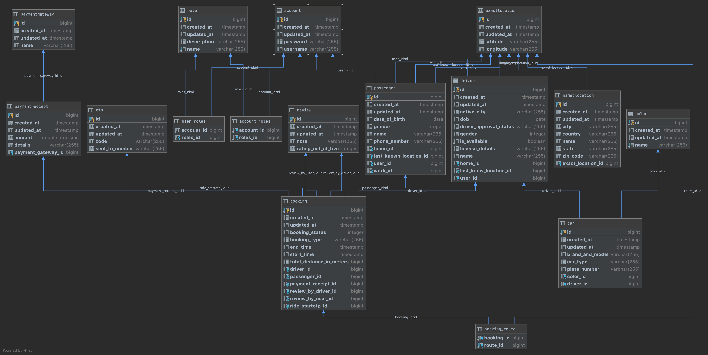

# Uber-Api-Design
Designing MVP for a cab booking application similar to Uber.

* Requirements.
* Low Level Design.
* High Level Design.
* API Design.
* Building Microservices.
* Deploying Services.

Technologies Used - Spring Boot, Hibernate, JPA, PostgresSQL, Redis.

# Template Used:
- FEATURE EXPECTATIONS [5 min]
        * Use cases.
        * Scenarios that we can ignore.
        * Who will use.
        * How many will use.
        * Usage patterns.
- ESTIMATIONS [5 min]
        * Throughput (QPS for read and write queries)
        * Latency expected from the system (for read and write queries)
        * Read/Write ratio
        * Traffic estimates
                * Write (QPS, Volume of data)
                * Read  (QPS, Volume of data)
        * Storage estimates
        * Memory estimates
                * If we are using a cache, what is the kind of data we want to store in cache
                * How much RAM and how many machines do we need for us to achieve this ?
                * Amount of data you want to store in disk/ssd
- DESIGN GOALS [5 min]
        (1) Latency and Throughput requirements
        (2) Consistency vs Availability  [Weak/strong/eventual => consistency | Failover/replication => availability]
(4) HIGH LEVEL DESIGN [5-10 min]
        (1) APIs for Read/Write scenarios for crucial components
        (2) Database schema
        (3) Basic algorithm
        (4) High level design for Read/Write scenario
(5) DEEP DIVE [15-20 min]
        (1) Scaling the algorithm
        (2) Scaling individual components: 
                -> Availability, Consistency and Scale story for each component
                -> Consistency and availability patterns
        (3) Think about the following components, how they would fit in and how it would help
                a) DNS
                b) CDN [Push vs Pull]
                c) Load Balancers [Active-Passive, Active-Active, Layer 4, Layer 7]
                d) Reverse Proxy
                e) Application layer scaling [Microservices, Service Discovery]
                f) DB [RDBMS, NoSQL]
                        > RDBMS 
                            >> Master-slave, Master-master, Federation, Sharding, Denormalization, SQL Tuning
                        > NoSQL
                            >> Key-Value, Wide-Column, Graph, Document
                                Fast-lookups:
                                -------------
                                    >>> RAM  [Bounded size] => Redis, Memcached
                                    >>> AP [Unbounded size] => Cassandra, RIAK, Voldemort
                                    >>> CP [Unbounded size] => HBase, MongoDB, Couchbase, DynamoDB
                g) Caches
                        > Client caching, CDN caching, Webserver caching, Database caching, Application caching, Cache @Query level, Cache @Object level
                        > Eviction policies:
                                >> Cache aside
                                >> Write through
                                >> Write behind
                                >> Refresh ahead
                h) Asynchronism
                        > Message queues
                        > Task queues
                        > Back pressure
                i) Communication
                        > TCP
                        > UDP
                        > REST
                        > RPC
(6) JUSTIFY [5 min]
	(1) Throughput of each layer
	(2) Latency caused between each layer
	(3) Overall latency justification

# Requirements:

  ### Passengers: 

* Passengers register by entering the phone number and confirming the OTP
* Passenger can request a cab booking by entering source and destination.
* Before booking the cab, passenger will see the ETA for the booking, the expected ride duration and the expected cost.
* After booking the ride also passenger should be able to see their ETA, expected ride duration and expected cost.
* Booking can be scheduled for now, or can be scheduled for a later time - max 3 days.
* Passenger can cancel an upcoming booking, if booking is scheduled for later time.
* A ride in progress cannot be cancelled - it can only be ended by the driver and passenger must pay some amount after ending the ride from driver side based on payment method.
* A Passenger can rate their experience of the current booking during the ride or after the ride has ended.
* Passengers can see their past, current and upcoming bookings.
* Passenger can update profile, update payment methods and other profile specific requirements.
* Ride sharing can be part of extensible feature.

  ### Booking:

* There are multiple types of bookings available - XL, Pool, Prime, Go, Rental
* When making a booking, the passenger must choose the type of booking.
* Once a booking is requested, the nearby drivers are alerted about the booking 
* The first driver to accept the booking is allotted to it.
* Drivers are chosen based on ETA to the location.
* While the trip is active, the passenger can add/remove/rearrange the stops, and the driver will be notified in real time.
* To start a ride, the passenger must share an OTP with the driver.
* The driver can end the ride at any time.

  ### Driver:
* After registering the driver must fill their profile and car details.
* The driver is allowed to accept rides only after their profile is approved by the admin.
* Only one car can be registered with one account. If a driver has multiple cars, they must use different accounts.
* Driver can see what booking they can accept, based on the real time notifications they are getting.
* Driver can see the expected earning from a booking.
* Driver can choose to accept a booking or to ignore it.
* Driver should not drive more than 14-hrs per day, so we should restrict the driver to further accept any bookings.

  ### System:
* The system must track each cab in real time.
* The system must should have a basic observability for different processes.
* Passenger can request a new booking only if they don’t have any pending payment.
* Admin panel to see statistics or any other admin related stuffs.

  ### Schema Design:

